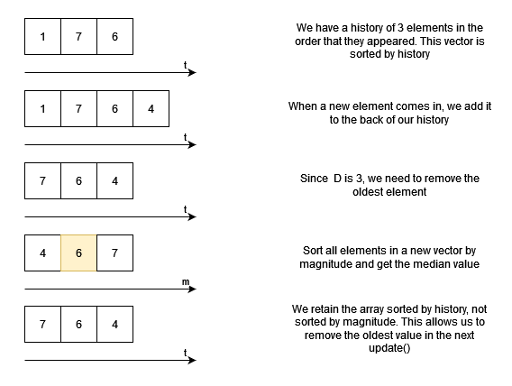
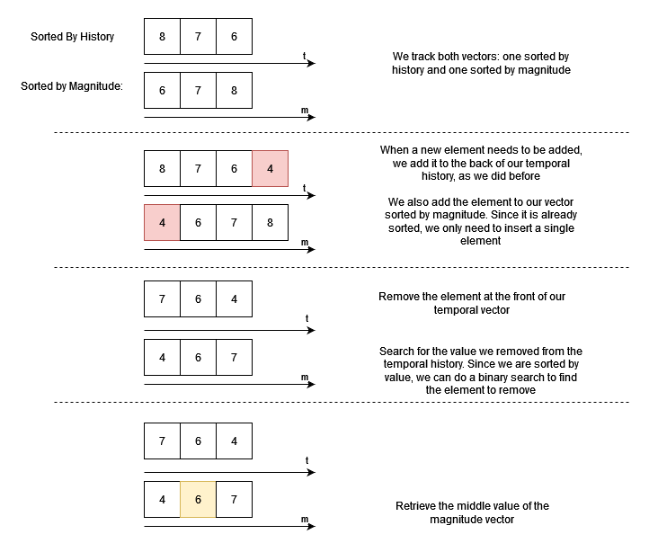
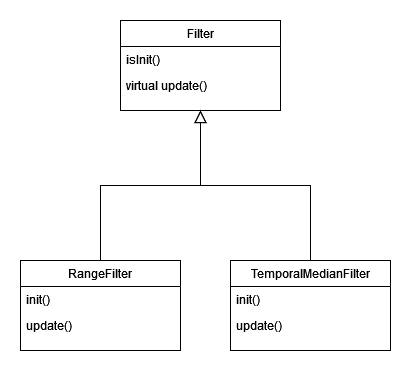

## Prerequisites
- CMake version 3.14 or newer
- C++11 compiler or newer

Note: If you are building the unit tests for the first time, you will also need internet access to download the Google gtest framework into the build directory. This is automatically downloaded to the build directory by CMake. You do not need to install the gtest framework manually.

## Running the Unit Tests
If this is the first time you are building, run the following command from the project root to setup the initial build directory:
```
cmake -S . -B build
```

Build the test executable:
```
cmake --build build
```

And then run the test executable:
```
build/test_filters
```

## Temporal Median Filter Algorithm

Consider a LIDAR scan of length N where we get the median of the last D scans.

### Intuitive Approach

We can keep a history of the last D scans as they occur. Whenever we want the filtered value, we sort the last D scans and return the median value for every point.

The issue with this approach is that every time we call update(), we must sort the last D values for all N points in the scan. For most sorting algoriths, this means that it would take O(D * log(D)) time to scan each point, meaning update() would take O(N * D * log(D)) time each update(). Can we do better?



*Sorting every update() would take O(N * D * log(D)) time*

### Improvements

One inefficiency we see with the first approach is that we must sort the entire history each update(). What if we added new scanned values in sorted order? Adding a single new point to a sorted vector would only take O(log(D)) time (because we only have to sort the new point, not all points in our history).

This seems like an immediate improvment, but remember that we need to track a history of the last D scans. If we store our last D scans by magnitude, we lose the temporal information, so we track two histories: one sorted by temporal order and another sorted by magnitude. When we need to perform an update(), we add only the new value to each vector. We remove the oldest value in temporal order and use binary search to remove the matching value from the magnitude vector. In this way, we are only adding or removing a single value at a time, rather than re-sorting the entire history each update().

With the new approach, for each point in the scan, it takes O(1) time to manage and update our temporal history if we use a queue. Inserting new values into our magnitude vector takes O(log(D)) time to find the proper location to insert or remove a single value. Performing the actual insertion or deletion takes O(D) time for vectors. Retrieval of the median takes O(1) time. For a single point, this means update() takes O(log(D) + D) time. For N points, this is O(N * log(D) + ND) time overall.



*Total Time Complexity: O(N * log(D) + ND)*

## Class Relationships and Recommended Use



Filter is the base class and interface to which modules may invoke the update() function. Only the creator of the filter needs to know what type of filter has been created and how to initialize the filter. Otherwise, after initialization, modules can invoke the update() function as a generalized Filter object.

See test_Filter.cpp for ideas on how this abstraction can be utilized. This approach is not required to use the filter but is recommended to allow for abstraction of the specific filter type.


